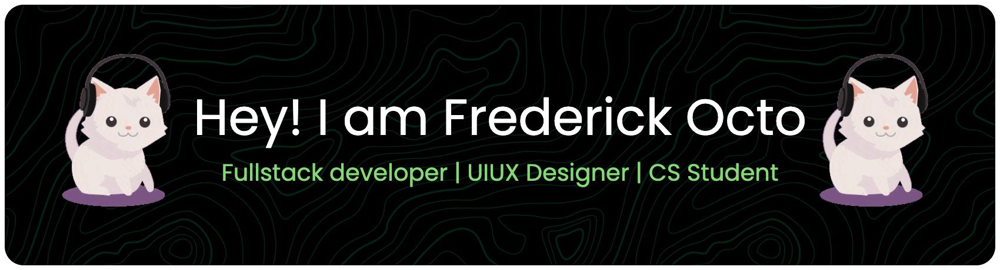

# Hi, I'm Erick Octo👋:
  
✨ Creating bugs since 2022  🧑🏻‍💻 I Love sharing about my journey in learning Software Engineering  🧑🏻‍🎓 Informatics IUP Student at Telkom University Bandung, Indonesia  🎯 Goals: To Be Startup Founder  🧠 Currently learning about AI and NextJS with TS, Machine Learning and Software Architecture  🧢 Making videos related to Computer Science, Tech and UIUX on [YouTube](https://www.youtube.com/@frederickocto3922)!  🎲 Fun fact: I Like To Explore New Things

###

<h2 align="left">Technologies and Programming Languages</h2>

###

Hello World!!, These are technologies and project management tools i use to build a cool software!

###

  
  
  
  
  
  
  
  
  
  
  
  
  
  
  
  
  
  
  
  
  
  
  
  
  
  
  
  
  
  
  
  
  
  
  
  
  
  
  
  
  
  
  
  
  
  
  
  
  
  
  
  
  
  
  
  
  
  
  
  
  
  
  
  
  
  
  
  
  
  
  

###

<h2 align="left">Lets Get In Touch: </h2>

###

Hey, these are my social media accounts, feel free to contact me if you want  to collaborate!

###

  
  
  
  
  
  
  

###

  
  
  
  

###

